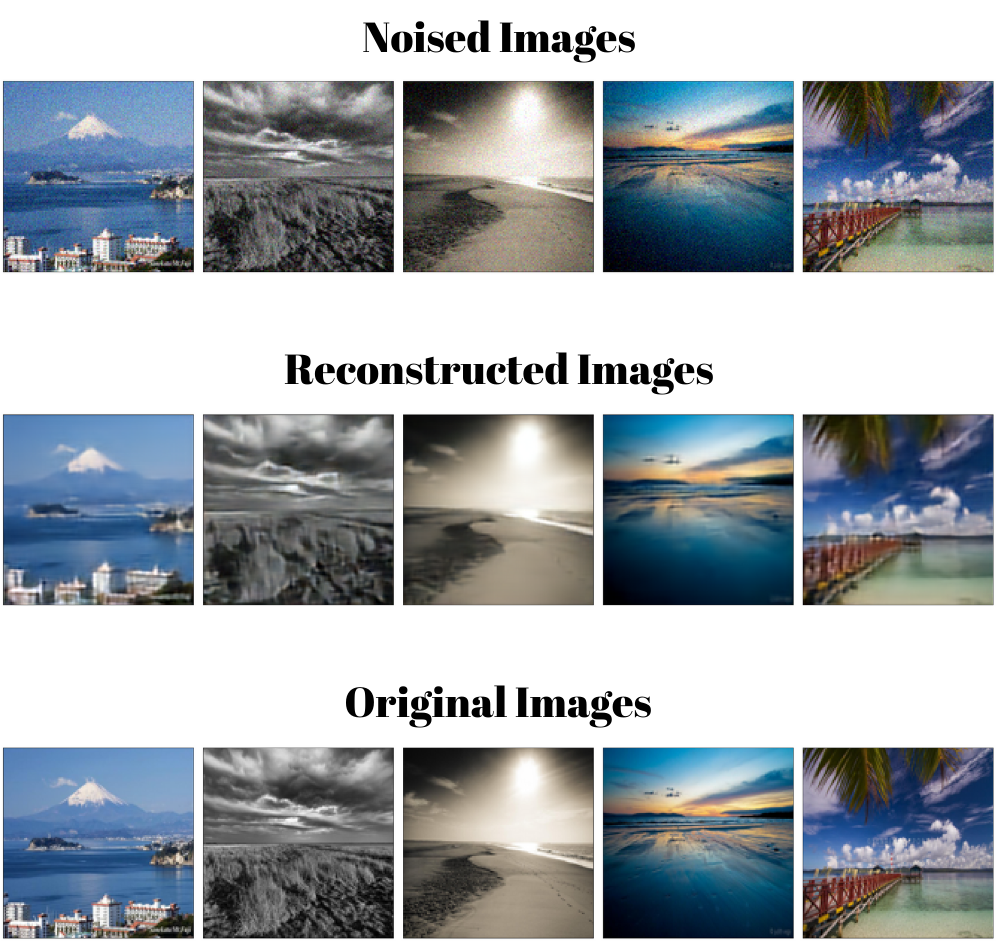
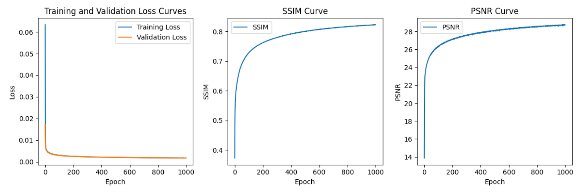
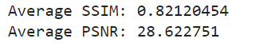
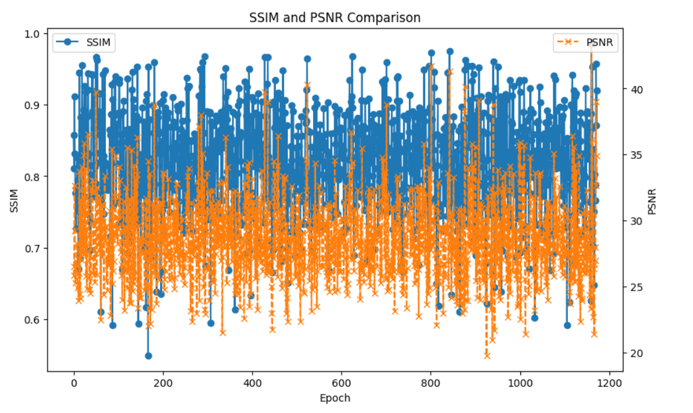

## Overview
Real-life datasets are invaluable for training machine learning models, but they often come with inherent flaws stemming from various factors.

In the context of images, these imperfections may include environmental conditions, varying lighting, and the presence of unwanted artifacts. External factors, such as sensor noise and compression artifacts, contribute to additional challenges.

In computer vision applications, noise disrupts the clarity and accuracy of image analysis, impacting domains like object recognition, scene understanding, and image segmentation. Noise reduction becomes crucial for improving the reliability of models operating in these domains.

Generative models, particularly AutoEncoders, have demonstrated their proficiency in mitigating noise and reconstructing high-quality images. This project specifically focuses on leveraging Convolutional AutoEncoders for the purpose of denoising landscape images, aiming to enhance the visual quality and interpretability of the data.

<h3> The following is a webpage-format report for the project: <a href="https://sambelh.azurewebsites.net/image-denoising/">https://sambelh.azurewebsites.net/image-denoising/</a></h3>

<h3 align="center">Denoising Results</h3>

  

## Approach

* **Dataset Loading:** The project starts by loading a dataset of training and validation images.

* **Noise Application:** Gaussian noise is applied to the clean images to create a corresponding noisy dataset. This step simulates the real-world noise present in the images by applying a random noise scale to each image in the dataset.

* **Convolutional AutoEncoder Design:** A Convolutional AutoEncoder (DAE - Denoising AutoEncoder) is designed to denoise the images. AutoEncoders have shown success in reconstructing clean images from noisy ones.

* **Training:** The designed DAE is trained using the Adam optimizer and Mean Square Error (MSE) loss function. This step involves optimizing the model parameters to learn the denoising task.

* **Evaluation Metrics:** The output model is evaluated using two metrics: Peak Signal-to-Noise Ratio (PSNR) and Structural Similarity Measure (SSIM). These metrics quantify the quality of the reconstructed images compared to the original ones.

* **Best Model Selection:** The best model is selected based on a combination of high PSNR and SSIM scores, indicating better image quality, and the convergence of the loss function (MSE).

## Dataset
The choice of landscapes for the dataset is deliberate. Landscape images, characterized by rich content, vibrant colors, and intricate features, provide an ideal testing ground for less complex image denoising tasks. 

The variety within the dataset ensures that the model can generalize well to diverse environmental conditions and image characteristics.

## Evaluation & Results

<h3 align="center">Training & Evalution Curves & Metric Curves</h3>

  

<h3 align="center">Average PSNR & SSIM Value for Evaluation Data</h3>

  

<h3 align="center">SSIM & PSNR Comparaison for Evaluation Data</h3>

  

<h3 align="center">Visual Inspection for Evaluation</h3>

  

## Contact
 Feel free to reach out to me on LinkedIn or through email & don't forget to visit my portfolio.
 

